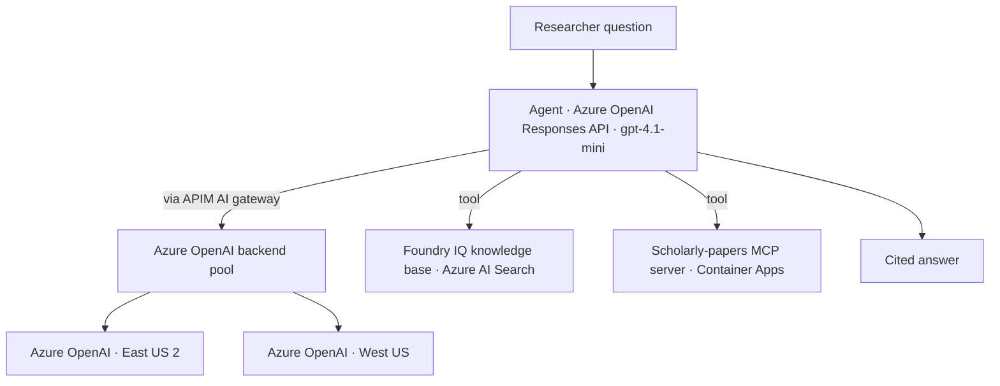
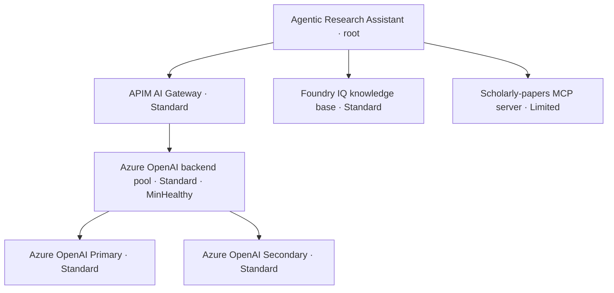
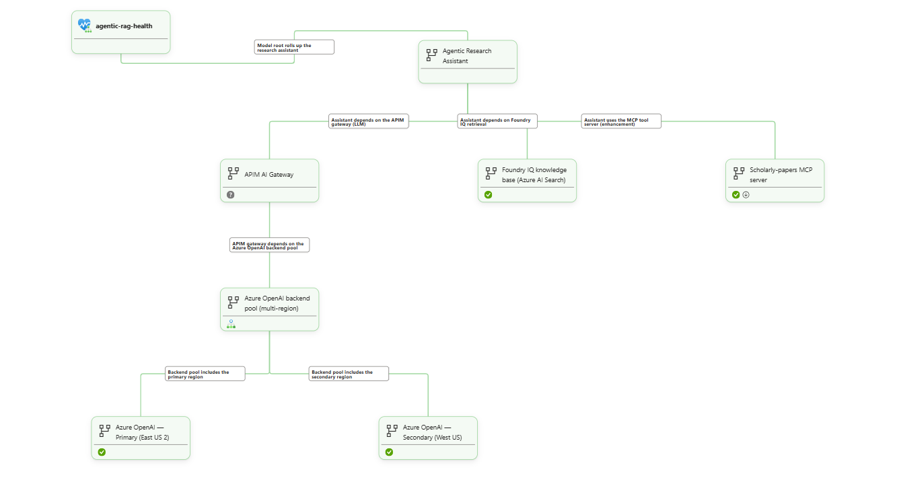
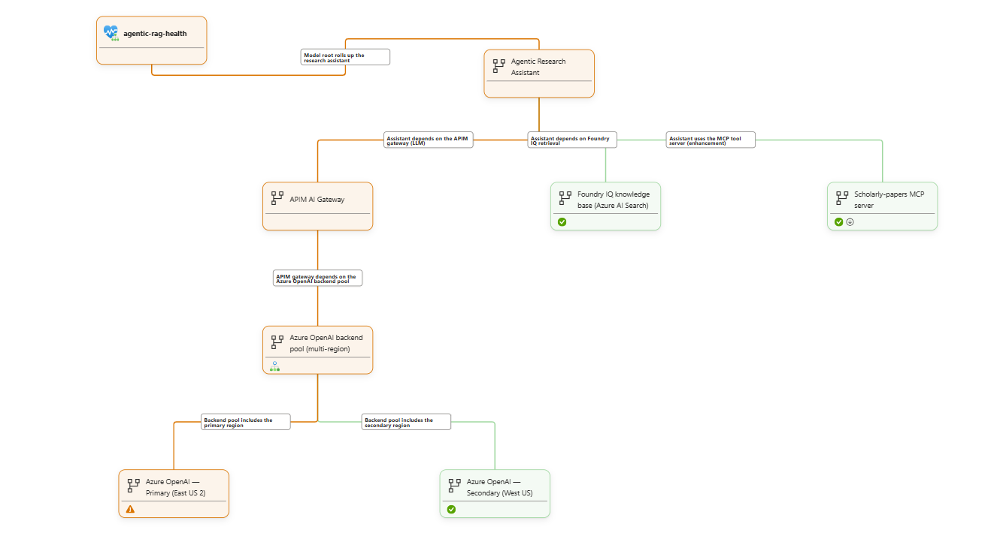
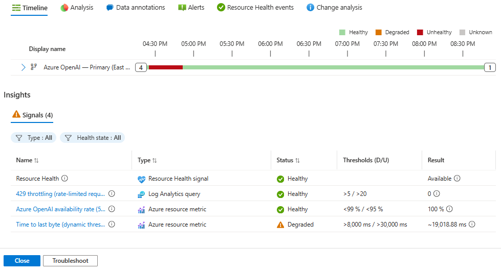
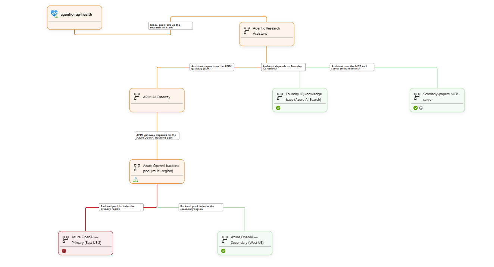
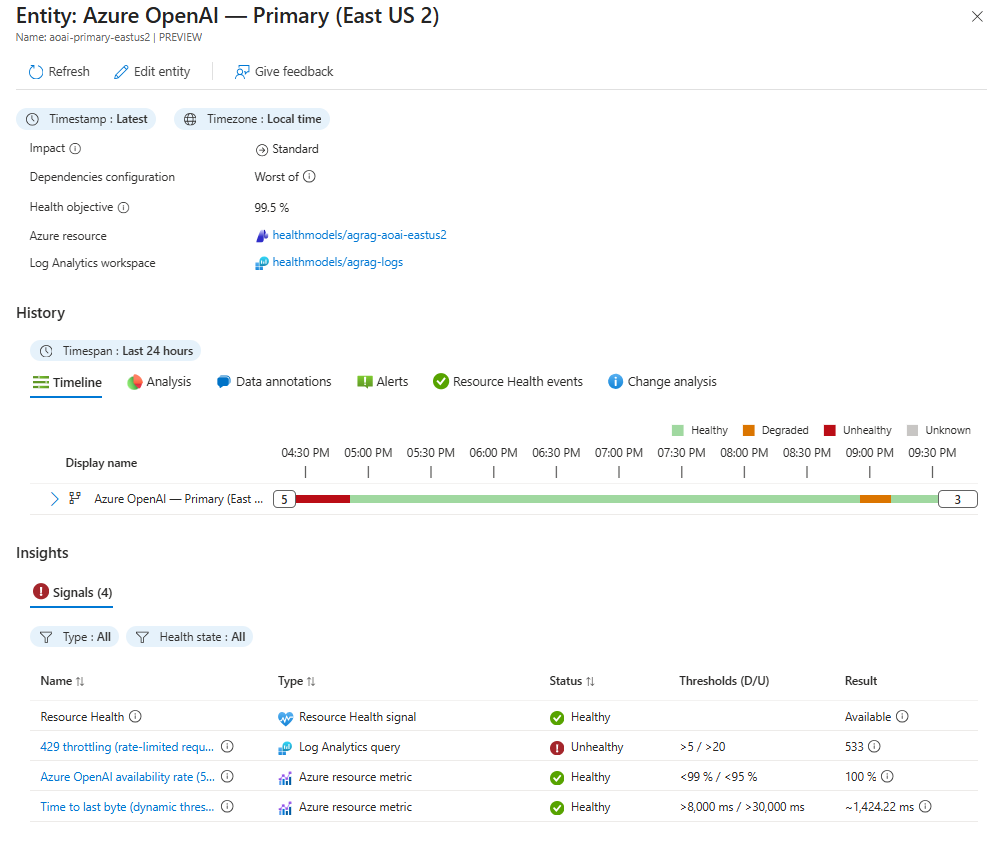

# Agentic RAG on Azure — Health Modeling PoC

A self-contained proof of concept that models the **health of an agentic RAG application**
with an [Azure Monitor health model](https://learn.microsoft.com/azure/azure-monitor/health-models/overview).

An *agentic research assistant* answers questions by planning tool calls across a
knowledge base and a scholarly-papers tool, then synthesizing a cited answer. That single
request path touches several Azure services — and "is the app healthy?" is a more useful
question than "is each resource up?". This PoC builds the workload, then layers a health
model on top that turns raw telemetry into one rolled-up answer an on-call engineer can trust.

> Everything here is net-new and deploys into its own resource group (`healthmodels`). No
> keys live in code — every hop uses managed identity + RBAC. Configuration comes from `.env`.

---

## The request path we model



The agent reaches Azure OpenAI through **API Management** acting as an AI gateway that
load-balances two regions. It grounds answers in a **Foundry IQ knowledge base** (Azure AI
Search over the ingested papers) and cross-checks them with a **scholarly-papers MCP server**
(Semantic Scholar) running on Container Apps.

---

## The health model

One entity per dependency, each reading only platform metrics, Log Analytics, and Azure
Resource Health — the model never touches the workload. Health rolls **child → parent** up to
a single root that carries the customer commitment and the alerts.



| Entity | Impact | Signals | Degraded → Unhealthy |
|---|---|---|---|
| **Agentic Research Assistant** (root) | Standard | rolls up dependencies (WorstOf) | Sev2 / Sev1 alerts, 99.9 objective |
| **APIM AI Gateway** | Standard | derives from the backend pool (WorstOf) | pool Degraded → Unhealthy |
| **Azure OpenAI backend pool** | Standard | MinHealthy over the 2 regions | 1 region down → Degraded, 0 → Unhealthy |
| **Azure OpenAI — Primary / Secondary** | Standard | `AzureOpenAIAvailabilityRate`, `AzureOpenAITTLTInMS` (latency), 429 (Log Analytics) | see below |
| **Foundry IQ knowledge base** | Standard | `SearchLatency`, `ThrottledSearchQueriesPercentage` | >1s / >5s, >5% / >20% |
| **Scholarly-papers MCP server** | **Limited** | `Replicas`, `RestartCount` | replicas <1, restarts >2 / >5 |

### Three modeling decisions worth calling out

**1. `Limited` impact on the MCP tool.** If the scholarly tool is down, the agent still
answers from the knowledge base — losing it is a lost *enhancement*, not an outage. So the MCP
entity has `Limited` impact: it can make the root **Degraded** but never **Unhealthy**. Every
other dependency has `Standard` impact and can drive a real outage. Impact is what stops a
non-critical dependency from paging someone at 3 a.m.

**2. Time-to-last-byte with a latency guardrail.** Absolute latency budgets age badly across
models and load, so the *recommended production* signal on `AzureOpenAITTLTInMS` is a **dynamic
threshold** that learns the normal band. Dynamic thresholds need a multi-day baseline, though —
early on, a single spike against a near-zero baseline reads as a false anomaly. So this PoC ships
a predictable **static guardrail** (degraded > 8 s, unhealthy > 30 s) and calls out the dynamic
option as the next step once the workload has history.

**3. A Log Analytics 429 signal.** Azure OpenAI's `AzureOpenAIAvailabilityRate` is **5xx-based
and does not count 429s** — yet throttling is the most common way an LLM backend "fails". Each
region carries an extra Log Analytics signal that counts HTTP 429s from the `RequestResponse`
diagnostic logs (**>5 → Degraded, >20 → Unhealthy**), so rate-limiting is visible where the
built-in availability metric is blind.

A 1-minute **canary probe** (a Logic App) pings both regions so availability and latency stay
populated on an idle workload — idle regions read **Healthy**, not **Unknown**.

---

## Signals, thresholds & roll-up — full reference

Use this section to walk a customer through *exactly* what each entity watches, how a raw
metric becomes a health state, and where built-in ML (dynamic thresholds) fits.

### How a health state is computed (three layers)

1. **Signal → signal state.** Each signal reads one metric or one Log Analytics query and
   compares the value to its **evaluation rules**. Each rule is an `operator` + `threshold`
   (or `Dynamic` + `sensitivity`). The signal is **Unhealthy** if the unhealthy rule matches,
   else **Degraded** if the degraded rule matches, else **Healthy**. No data → **Unknown**.
2. **Signal → entity.** An entity's own state is the **worst of its signals** — one Unhealthy
   signal makes the entity Unhealthy. (Azure Resource Health is just another signal.)
3. **Entity → parent.** A *relationship* makes an entity a child of another; the parent's
   `dependencies.aggregationType` decides the roll-up:
   - **WorstOf** — parent inherits the worst child state.
   - **MinHealthy (Absolute)** — counts healthy children: `healthy > degradedThreshold` →
     Healthy; `unhealthyThreshold < healthy ≤ degradedThreshold` → Degraded; `healthy ≤
     unhealthyThreshold` → Unhealthy.
   - **Impact caps** how bad a child can make its parent: a **`Limited`** child that is
     Unhealthy contributes at most **Degraded**; **`Suppressed`** contributes nothing;
     **`Standard`** propagates in full.

### Per-entity signals

**Agentic Research Assistant (root)** — impact Standard · objective 99.9 · **WorstOf** over
{APIM, Foundry IQ, MCP}. No direct signals. Alerts: **Sev1** on Unhealthy, **Sev2** on Degraded.

**APIM AI Gateway** — impact Standard · **no direct signal** · WorstOf over the backend pool, so
the gateway's health mirrors the Azure OpenAI pool it fronts.

> **Why no Resource Health signal?** The **Consumption** APIM SKU isn't covered by Azure Resource
> Health — it returns `Unknown` (*"We are currently unable to determine the health of this API
> Management service"*), which renders as a **"?"** badge with no metric signal to offset it. So the
> entity has no `azureResource` block and derives its state from its dependency. On a **dedicated**
> APIM SKU (Developer/Basic/Standard/Premium), add back an `azureResource` block with `resourceHealth`
> enabled — and/or a Log Analytics signal counting 5xx from `ApiManagementGatewayLogs`.

**Azure OpenAI backend pool** — impact Standard · no direct signals · **MinHealthy(Absolute,
degraded = 1, unhealthy = 0, ignoreUnknown)** over the two regions → 2 healthy = Healthy,
1 = Degraded, 0 = Unhealthy.

**Azure OpenAI — Primary / Secondary** — impact Standard · objective 99.5 · worst-of 4 signals:

| Signal | Source | Aggregation / grain | Threshold type | Degraded | Unhealthy |
|---|---|---|---|---|---|
| availability | `AzureOpenAIAvailabilityRate` (metric) | Average / 5 min | static | < 99% | < 95% |
| time-to-last-byte | `AzureOpenAITTLTInMS` (metric) | Average / 5 min | **static** *(ML-ready — see below)* | > 8 s | > 30 s |
| throttling-429 | KQL over `AzureDiagnostics` `RequestResponse` | count over trailing 5 min | static | > 5 (in 5 min) | > 20 (in 5 min) |
| resource health | platform | — | — | degraded | unavailable |

**Foundry IQ knowledge base (Azure AI Search)** — impact Standard · worst-of 3 signals:

| Signal | Source | Aggregation / grain | Threshold type | Degraded | Unhealthy |
|---|---|---|---|---|---|
| search-latency | `SearchLatency` (metric) | Average / 5 min | static | > 1 s | > 5 s |
| search-throttling | `ThrottledSearchQueriesPercentage` (metric) | Average / 5 min | static | > 5% | > 20% |
| resource health | platform | — | — | degraded | unavailable |

**Scholarly-papers MCP server** — impact **Limited** · worst-of 2 signals:

| Signal | Source | Aggregation / grain | Threshold type | Degraded | Unhealthy |
|---|---|---|---|---|---|
| replica-availability | `Replicas` (metric) | Average / 5 min | static | — | < 1 |
| restarts | `RestartCount` (metric) | Maximum / 5 min | static | > 2 | > 5 |
| resource health | **Disabled** | — | — | — | — |

> **Why Resource Health is disabled on the MCP entity:** Azure Container Apps is **not
> supported** by Azure Resource Health (`HTTP 422 UnsupportedResourceType`), so an enabled RH
> signal would sit permanently **Unknown** and render as a red error badge. It's explicitly set
> to `Disabled`. (The CloudHealth RP merges updates, so it must be set to `Disabled` — *omitting*
> it does not remove an already-created signal.)

### Built-in ML: dynamic thresholds (and why TTLB is static in this PoC)

**What they are.** Azure Monitor **dynamic thresholds** use machine learning to study a metric's
own history — its typical level, its variance, and daily/weekly seasonality — and compute an
**adaptive band**. Any point outside the learned band is flagged as an anomaly. You never pick a
millisecond number; the model derives "normal" from the signal's past.

**Sensitivity** tunes how tight the band is:

| Sensitivity | Band | Behaviour |
|---|---|---|
| **High** | tight | catches small deviations, more sensitive (more alerts) |
| **Medium** | balanced | the usual production default |
| **Low** | wide | only large deviations trip it |

**They need a training window.** Dynamic thresholds learn from historical data — Azure Monitor
needs roughly **3+ days** of history (and enough data points) before the model is reliable; more
history sharpens it. On a **fresh or low-traffic** signal there is no baseline yet, so a single
outlier can look like a severe anomaly.

**How to use it in the health model.** Dynamic is allowed on the **`unhealthyRule` only** (not on
`degradedRule`):

```bicep
evaluationRules: {
  // ML-based: learns the normal time-to-last-byte band and flags anomalies.
  unhealthyRule: { operator: 'Dynamic', sensitivity: 'Medium' }
}
```

**Dynamic vs static — when to pick which:**

| Use **dynamic** (ML) when… | Use **static** when… |
|---|---|
| "Normal" drifts with model/version/load/time-of-day (latency, request volume, tokens/sec) | There's a hard, well-known limit (availability %, replica count, restarts, throttle count) |
| A fixed number would age badly or need constant re-tuning | You want a predictable, explainable threshold from minute one |
| You have ≥ ~3 days of representative history | The signal is brand-new or very low traffic |

**Why this PoC ships TTLB as static.** `AzureOpenAITTLTInMS` is *exactly* the kind of drifting
latency signal that dynamic thresholds are built for — that's why the code is **ML-ready**. But a
freshly-deployed demo has no baseline: during bring-up a single **3.7 s** spike (from a load test)
against an otherwise **~0 ms** baseline made a `Dynamic/High` rule read **Unhealthy** instantly —
the classic cold-start pitfall. So the demo uses a **static guardrail** (degraded > 10 s, unhealthy
> 20 s) that reads predictably today. **In production**, once the region has a few days of latency
history, switch the two `time-to-last-byte` blocks in [infra/health-model.bicep](infra/health-model.bicep)
to the `Dynamic` form above and redeploy — the model will then learn each region's normal latency
band and flag genuine regressions without a hand-tuned number.

### The Log Analytics 429 signal (closing a metric blind spot)

`AzureOpenAIAvailabilityRate` is **5xx-based and does not count HTTP 429s**, yet throttling is the
most common way an LLM backend "fails". Each region therefore carries a **Log Analytics** signal
that **counts HTTP 429 responses** in the `RequestResponse` diagnostic logs.

**What the `> 5` / `> 20` thresholds mean.** They are an **absolute count of 429s over a trailing
5‑minute window**, re‑evaluated every minute — *not* a per‑second or per‑minute rate. The query is
`… | where TimeGenerated > ago(5m) | summarize throttled = countif(ResultSignature == "429")`, so the
number is simply "how many requests were throttled in the last 5 minutes": **> 5 → Degraded,
> 20 → Unhealthy**. (In the throttling screenshot below the result is **533** — far past 20 — so the
region reads Unhealthy.) A bare `summarize` returns a single `0` row when idle, so an idle region reads
**Healthy**, not Unknown.

### Keeping idle signals alive

A 1-minute **canary probe** (Logic App, managed identity) calls both regions' Responses endpoint
so availability and latency stay populated even with no user traffic — idle regions read
**Healthy**, not **Unknown**.

---

## Alerting

Health-model alerts are **state-based**: an alert fires when an *entity's* health state changes to
**Degraded** or **Unhealthy** — not per signal. The entity's signals and child dependencies decide the
state, and one alert fires for the whole entity
([docs](https://learn.microsoft.com/azure/azure-monitor/health-models/alerts)).

### What this PoC configures

All alerting is on the **root** entity (`Agentic Research Assistant`), routed to the `agentic-rag-ag`
action group (an email receiver from `--alert-email`; you can attach up to **five** action groups per
entity for Teams / webhook / ITSM / Logic App / runbook):

| Root state | Severity | Meaning | Response |
|---|---|---|---|
| **Unhealthy** | **Sev1** | researchers can't reliably get grounded answers (outage) | page on-call |
| **Degraded** | **Sev2** | still answering, but a `Standard` dependency (a region, the KB, or Search) is impaired | notify / investigate |

Alerts **auto-resolve** when the entity returns to Healthy, and a **single** alert fires even if several
signals are bad at once.

### The alert definition (entity + signals, in code)

The alert is attached to the **root entity** in [infra/health-model.bicep](infra/health-model.bicep). The
root has **no direct signals** — its state is the `WorstOf` of its dependencies, so the alert is actually
driven by the signals on those dependencies (availability, time-to-last-byte, 429, search
latency/throttling, replicas/restarts — see [Per-entity signals](#per-entity-signals) above). The
`alerts` block maps each entity **state** to a severity and one or more action groups:

```bicep
resource rootEntity 'Microsoft.CloudHealth/healthmodels/entities@2026-09-01-preview' = {
  parent: healthModel
  name: 'agentic-research-assistant'
  properties: {
    displayName: 'Agentic Research Assistant'
    impact: 'Standard'
    signalGroups: {
      dependencies: { aggregationType: 'WorstOf' }   // state = worst dependency (APIM / Foundry IQ / MCP)
    }
    alerts: {
      unhealthy: { severity: 'Sev1', description: 'Outage: no reliable grounded answers.', actionGroupIds: [ actionGroup.id ] }
      degraded:  { severity: 'Sev2', description: 'Partial: a Standard dependency is impaired.', actionGroupIds: [ actionGroup.id ] }
    }
  }
}
```

The `actionGroup` is *where* notifications are delivered. It gets an email receiver **only when you pass an
address** — otherwise it's created empty (the alert still fires and is visible in **Azure Monitor →
Alerts**, but nobody is notified):

```bicep
resource actionGroup 'Microsoft.Insights/actionGroups@2023-01-01' = {
  name: 'agentic-rag-ag'
  properties: {
    groupShortName: 'agRagHealth'
    emailReceivers: empty(alertEmail) ? [] : [
      { name: 'oncall', emailAddress: alertEmail, useCommonAlertSchema: true }
    ]
  }
}
```

To alert on a *specific dependency* as well (say, page only when the Azure OpenAI pool is Unhealthy), add
the same `alerts: { ... }` block to that entity — but do it sparingly to avoid duplicate alerts.

### Deploy / enable the alert

The alert **rules** ship with the health model — `deploy_health_model.py` (re)creates them on every
deploy. To actually **notify someone**, pass an email so the action group gets a receiver:

```powershell
# Adds an 'oncall' email receiver to the action group. Re-running is idempotent (safe against the live model).
python infra/deploy_health_model.py --alert-email you@example.com
```

You can also set `ALERT_EMAIL=you@example.com` in `.env` instead of the flag. Without either, the action
group is created **empty**: the alert fires and shows in the portal, but no email/SMS/webhook goes out.
Verify the receiver landed:

```powershell
az monitor action-group show -g healthmodels -n agentic-rag-ag --query emailReceivers -o json
```

Add more channels (SMS, Teams/webhook, Logic App, ITSM/ServiceNow, Azure Function, runbook) by extending
the `actionGroup` receivers in `infra/health-model.bicep`, or attach additional action groups — up to
five per entity.

### Why alert on the root, not on every signal

State-based, root-level alerting is the health-model best practice: it **reduces noise** (one alert per
workload-impacting change instead of one per signal), **consolidates** many dependencies into a single
customer-facing signal, and **auto-resolves**. The leaf entities (regions, Search, MCP) carry signals
but **no alerts** — you investigate them from the graph once the root alert points you there.

### Minimizing false positives (noise)

- **Alert on state, at the root only** — one consolidated alert per impacting change, never a per-signal storm.
- **`Limited` impact on the MCP tool** — a downed enhancement can only *degrade* the root, never page it as an outage.
- **`ignoreUnknown` on roll-ups** — a dependency with no data goes Unknown and is *ignored*, instead of dragging the parent down and firing a spurious alert.
- **A 1-minute canary probe** keeps availability/latency populated, so an *idle* region reads Healthy, not Unknown — no "quiet workload" false alarms.
- **A static latency guardrail** (not a cold-start dynamic threshold) avoids the fresh-baseline false anomaly; switch to dynamic once there's history.

### Minimizing false negatives (missed issues)

- **Alert on Degraded *and* Unhealthy** — partial impairment (one region down, throttling, slow Search) notifies instead of silently passing.
- **Cover metric blind spots** — the Log Analytics **429** signal catches throttling that `AzureOpenAIAvailabilityRate` (5xx-only) misses.
- **Model grounding quality as `Standard`** — a Foundry IQ / Search failure can drive the root Unhealthy; an assistant that can't ground its answers isn't healthy even if the LLM path is fine.
- **Keep signals live** — the canary means a genuinely dead region shows Unhealthy (real data), not an ignored Unknown.

> **Avoid duplicate alerts.** If the modeled resources already have resource-specific alert rules,
> disable them once you trust the health-model alerts (or run both briefly to validate), per the
> [migration guidance](https://learn.microsoft.com/azure/azure-monitor/health-models/alerts#migrate-from-resource-specific-alert-rules).

---

## Repository layout

```
AgenticRAGHealthModeling/
├─ README.md                        · this file
├─ .env.example                     · configuration template (copy to .env)
├─ agentic_rag_health_demo.ipynb    · the demo + failure scenarios
├─ papers/                          · research PDFs ingested into the knowledge base
├─ images/                          · portal screenshots referenced by this README
├─ mcp-server/
│  ├─ server.py                     · scholarly-papers MCP server (FastMCP, streamable-HTTP)
│  ├─ Dockerfile
│  └─ requirements.txt
└─ infra/
   ├─ base-infra.bicep              · AOAI ×2, Search, Log Analytics, APIM, Container Apps env
   ├─ health-model.bicep            · the health model, entities, signals, alerts, canary probe
   ├─ responses-ha.policy.xml       · APIM policy: /responses load-balancing + MI auth + retry
   ├─ configure_apim.py             · wires the APIM responses-HA API + backend pool
   ├─ ingest_papers.py              · creates the Foundry IQ knowledge base from papers/
   ├─ deploy_health_model.py        · deploys health-model.bicep from .env
   └─ _build_notebook.py            · regenerates agentic_rag_health_demo.ipynb
```

---

## Deploy it yourself

### Prerequisites

- **Azure subscription** with quota for Azure OpenAI in **two regions** and Azure AI Search, plus
  permission to create resources **and role assignments** in the target resource group.
- **Azure CLI** — `az login` to the subscription/tenant you're deploying to
  (`az account set --subscription <id>`).
- **Python 3.11+** — for the helper scripts:
  `pip install openai httpx azure-identity python-dotenv requests`.
- **Docker** — to build the MCP server container image (used by `az containerapp up`).
- **Health models are in preview** and available in a subset of regions — this PoC deploys the model
  in `centralus`; the workload resources can live elsewhere (here: East US 2 + West US). Register the
  resource provider once: `az provider register --namespace Microsoft.CloudHealth`.
- **Search data-plane roles** (for the knowledge-base step) — your `az login` identity needs
  `Search Service Contributor` + `Search Index Data Contributor`, and the Search service must have AAD
  data-plane auth (`--auth-options aadOrApiKey`); `base-infra.bicep` enables it.

### Deploy the infrastructure

```powershell
# 0. Configure. Copy the template and fill in your subscription/tenant.
Copy-Item .env.example .env    # then edit values

# 1. Base infrastructure (AOAI ×2, Search, Log Analytics, APIM, Container Apps env).
az group create -n healthmodels -l eastus2
az deployment group create -g healthmodels --template-file infra/base-infra.bicep `
  --parameters apimPublisherEmail=you@example.com

# 2. Wire the APIM responses-HA API + two-region backend pool.
python infra/configure_apim.py           # prints APIM_SUBSCRIPTION_KEY -> put it in .env

# 3. Build + deploy the scholarly-papers MCP server to Container Apps.
az containerapp up -n agrag-scholar-mcp -g healthmodels --source mcp-server `
  --ingress external --target-port 3000 --env-vars MCP_TRANSPORT=http
az containerapp update -n agrag-scholar-mcp -g healthmodels --min-replicas 1 --max-replicas 3

# 4. Ingest the papers into a Foundry IQ knowledge base (keyless embeddings).
python infra/ingest_papers.py

# 5. Deploy the health model (entities, signals, alerts, canary probe).
python infra/deploy_health_model.py --alert-email you@example.com
```

Then open **`agentic_rag_health_demo.ipynb`** and run the cells: a healthy baseline, then
scenarios that push latency, throttling, a downed tool server, and retrieval load — each one
annotated with what it does and which health signal should move.

### Notes on identity / RBAC

- The **Search** managed identity gets `Cognitive Services OpenAI User` on the primary Azure
  OpenAI account, so it embeds + synthesizes keylessly.
- The **APIM** managed identity gets `Cognitive Services User` on both Azure OpenAI accounts.
- The **health model** identity gets `Monitoring Reader` on the resource group.
- The **canary probe** identity gets `Cognitive Services OpenAI User` on both accounts.
- To create the knowledge base, your `az login` identity needs `Search Service Contributor` +
  `Search Index Data Contributor`, and the Search service must have AAD data-plane auth enabled
  (`--auth-options aadOrApiKey`). `base-infra.bicep` enables it for you.

---

## Reading the model in the portal

**Azure Monitor → Health models → `agentic-rag-health`.** The entity graph shows the root with
its dependencies; colour is current health. Click a region to see availability, the
time-to-last-byte band, and the 429 count; click the MCP server to see replicas and restarts.
Watch how the MCP server going Unhealthy only makes the root **Degraded** (Limited impact),
while an Azure OpenAI region or Search going Unhealthy can make the root **Unhealthy** (Standard).
The root fires **Sev1** on Unhealthy and **Sev2** on Degraded to the action group.

Signals refresh about every minute; Log-Analytics-based signals lag 1–2 minutes.

### What Healthy / Degraded / Unhealthy looks like

Three states of the same model, captured from the portal. The graph shows where the state rolls up;
the region's **entity → Signals** view shows which signal moved and to what value.

**Healthy baseline.** With the canary probe keeping signals populated and no failure injected, every
entity is green and the root is Healthy — the state the model sits in between scenarios.



**Scenario 1 — Latency (time‑to‑last‑byte).** Sustained long‑output load pushes the primary region's
`AzureOpenAITTLTInMS` past the 8 s degraded threshold, so the region goes **Degraded**. Via `MinHealthy`
(1 of 2 healthy) the pool → APIM → root all show **Degraded** — while `availability` stays 100 % and
`429 throttling` stays 0 (this is latency, not errors or throttling).





**Scenario 2 — Throttling (429).** Shrinking the primary deployment's capacity and hammering it makes
every request return **HTTP 429**. The **Log Analytics 429 signal** climbs past 20 — here **533** in the
trailing 5‑minute window — so the region goes **Unhealthy**. But `availability` stays **100 %** because
429 is a client error, not a 5xx; `MinHealthy` + a healthy secondary keep the pool/root at **Degraded**
rather than a hard outage.





> The contrast is the point: latency degrades the region on the **time‑to‑last‑byte** signal, throttling
> on the **429** signal — and in both cases `MinHealthy` plus a healthy secondary hold the *pool* at
> Degraded instead of a full outage. (Save the four screenshots under `images/` with the filenames above.)

---

## Health-modeling guidance (the transferable lessons)

- **Model the customer promise, not the resource list.** The root entity is "a researcher gets a
  grounded, cited answer" — everything else is a dependency that either supports or degrades it.
- **Use `impact` to encode what actually pages you.** `Standard` for anything on the critical
  path; `Limited` for enhancements whose loss is survivable. This is the single highest-leverage
  knob for alert quality.
- **Prefer dynamic thresholds for latency-like signals** that drift with model/version/load, and
  keep a static guardrail alongside them for an absolute ceiling.
- **Fill the gaps the built-in metrics leave.** Availability metrics that ignore 429s are common;
  a small Log Analytics signal closes the blind spot.
- **Keep idle signals populated** with a cheap canary so "no traffic" reads Healthy, not Unknown.
- **Roll up deliberately.** `WorstOf` for "any critical dependency down = degraded"; `MinHealthy`
  for redundant pools where N-of-M healthy is the real SLO.

---

## Clean up

```powershell
az group delete -n healthmodels --yes --no-wait
```

This removes every resource created by the PoC, including the health model and the canary probe.
